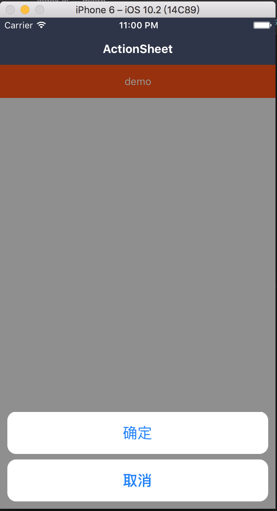

### ActionSheet 上拉按钮组

依赖 Popover 组件

#### 使用方法

```js
<ActionSheet  visible={this.state.visible} />
```

#### 具体效果



#### propTypes

```js
ActionSheet.propTypes = {
  // 自定义样式
  style: View.propTypes.style,
  // Popover 的 props
  // 控制开关
  visible: Popover.propTypes.visible,
  // 遮罩层样式
  maskStyle: Popover.propTypes.maskStyle,
  // 打开遮罩层回调
  onOpen: Popover.propTypes.onOpen,
  // 关闭遮罩层回调
  onClose: Popover.propTypes.onClose,
  // 动画时长
  duration: Popover.propTypes.duration,
  // 事情是否穿透
  pointerEvents: Popover.propTypes.pointerEvents,
  // 按钮配置项
  btnOpts: PropTypes.arrayOf(PropTypes.shape({
    // key
    key: PropTypes.string,
    // 样式
    style: View.propTypes.style,
    // 文字
    text: PropTypes.string,
    // 文字样式
    textStyle: Text.propTypes.style,
    // 点击回调
    onPress: PropTypes.func,
    /* eslint-enable */
  })),
  // 取消按钮
  btnOpts: PropTypes.arrayOf(PropTypes.shape({
    // 样式
    style: View.propTypes.style,
    // 文字
    text: PropTypes.string,
    // 文字样式
    textStyle: Text.propTypes.style,
    // 点击回调
    onPress: PropTypes.func,
  })),
  // 按钮样式
  btnStyle: View.propTypes.style,
  // 按钮文字样式
  btnTextStyle: Text.propTypes.style,
};
```

#### 默认值

```js
ActionSheet.defaultProps = {
  style: null,
  visible: false,
  maskStyle: null,
  onOpen: NOOP,
  onClose: () => {11},
  duration: 200,
  pointerEvents: 'auto',
  btnOpts: [{
    key: 'confirm',
    style: null,
    text: '确定',
    textStyle: null,
    onPress: NOOP,
  }],
  cancelBtn: {
    style: null,
    text: '取消',
    textStyle: null,
    onPress: NOOP,
  },
  btnStyle: null,
  btnTextStyle: null,
};
```
