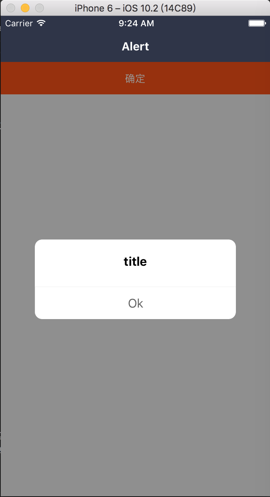

### Alert: 对话框

在 Dialog 组件进行了封装，同时也继承 Dialog 属性，支持一个按钮的形态

#### 使用方法

```js
<Alert
  title="title"
  visible={this.state.visible}
  onPress={this.hide}
/>
```

#### 具体效果



#### props

```js
Alert.propTypes = {
  ...Dialog.propTypes,
  // title
  title: PropTypes.string,
  // 按钮
  btnTex: PropTypes.string,
  // 按钮样式
  btnTexStyle: Text.propTypes.style,
  // 按钮回调
  onPress: PropTypes.func,
};
```

#### 默认值

```js
Alert.defaultProps = {
  ...Dialog.defaultProps,
  title: 'title',
  btnTex: 'Ok',
  btnTexStyle: null,
  onPress: NOOP,
};
```
