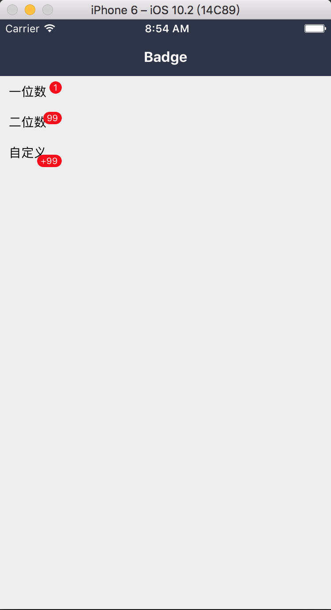

### Badge: 出现在按钮、图标旁的数字或状态标记。

#### 使用方法

```js
<View style={styles.view}>
  <Badge
    text={'+99'}
    textWrapStyle={{
      top: 10,
    }}
  >
    <Text>自定义</Text>
  </Badge>
</View>
```

#### 具体效果



#### props

```js
Badge.propTypes = {
  // 自定义样式
  style: View.propTypes.style,
  // 子元素
  children: PropTypes.oneOfType([PropTypes.element, PropTypes.array]),
  // 文本容器样式
  textWrapStyle: View.propTypes.style,
  // 文本样式
  textStyle: Text.propTypes.style,
  // 单个字符宽度
  characterWidth: PropTypes.number,
  // 角标文本内容
  text: PropTypes.oneOfType([PropTypes.string, PropTypes.number]),
};
```

#### 默认值

```js
Badge.defaultProps = {
  style: null,
  children: null,
  textWrapStyle: null,
  textStyle: null,
  characterWidth: 7,
  text: '',
};
```
