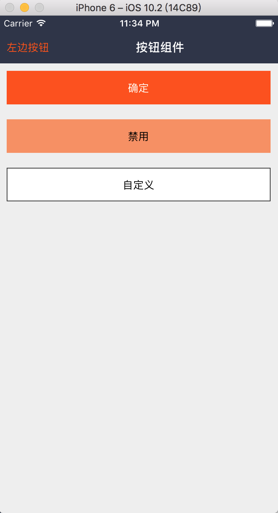

### Btn: 按钮

#### 使用方法

```js
// 默认
<Btn />

// 禁用
<Btn
  disabled
  style={{
    backgroundColor: 'rgba(255, 82, 0, 0.6)'
  }}
>
  <Text>禁用</Text>
</Btn>

// 自定义
<Btn
  style={{
    backgroundColor: '#FFF',
    borderWidth: 1,
    borderColor: '#333'
  }}
  btnStyle={{ color: '#666' }}
>
  <Text>自定义</Text>
</Btn>
```

#### 具体效果

 

#### props

```js
Btn.propTypes = {
    // 自定义样式
  style: View.propTypes.style,
  // 按钮文本样式: 当 children 为字符串时才生效
  btnStyle: Text.propTypes.style,
  // 是否禁用: true 时，activeOpacity 为 1, onPress 为 NOOP
  disabled: PropTypes.bool,
  // 内部容器样式
  contentContainerStyle: View.propTypes.style,
  // 按钮热区
  hitSlop: TouchableOpacity.propTypes.hitSlop,
  // 点击回调
  onPress: PropTypes.func,
  // 点击时透明度反馈
  activeOpacity: PropTypes.number,
  // 按钮内容
  children: PropTypes.oneOfType([PropTypes.string, PropTypes.element, PropTypes.array]),
  // 按钮热区
  hitSlop: TouchableOpacity.propTypes.hitSlop,
};
```

#### 默认值

```js
Btn.defaultProps = {
  style: null,
  btnStyle: null,
  disabled: false,
  contentContainerStyle: null,
  hitSlop: {
    top: 0,
    bottom: 0,
    left: 0,
    right: 0,
  },
  onPress: null,
  activeOpacity: ACTIVE_OPACITY,
  children: '确定',
};
```
