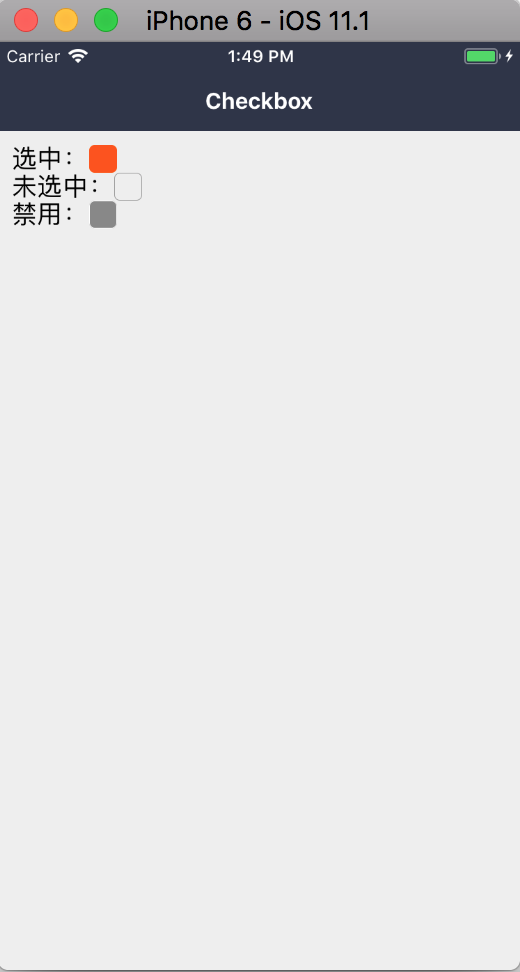

### Checkbox 多选

支持自定义选中、不选中、禁用的组件化

#### 使用方法

```js
<Checkbox
  checked={this.state.visible}
  onChange={this.onChange}
/>
```
#### demo



#### props

```js
Checkbox.propTypes = {
  // id
  id: PropTypes.oneOfType([PropTypes.string, PropTypes.number]),
  // id 对应的值
  value: PropTypes.string,
  // 自定义样式
  style: View.propTypes.style,
  // 是否选中
  checked: PropTypes.bool,
  // 选中组件
  checkedComponent: PropTypes.element,
  // 未选中组件
  uncheckedComponent: PropTypes.element,
  // 禁用组件
  disabledComponent: PropTypes.element,
  // 点击回调
  onChange: PropTypes.func,
  // 是否禁用
  disabled: PropTypes.bool,
};
```

#### 默认值

```js
Checkbox.defaultProps = {
  id: null,
  value: null,
  style: null,
  checked: false,
  checkedComponent: <View style={styles.checked} />,
  uncheckedComponent: <View style={styles.unchecked} />,
  disabledComponent: <View style={styles.disabled} />,
  onChange: NOOP,
  disabled: false,
};
```
