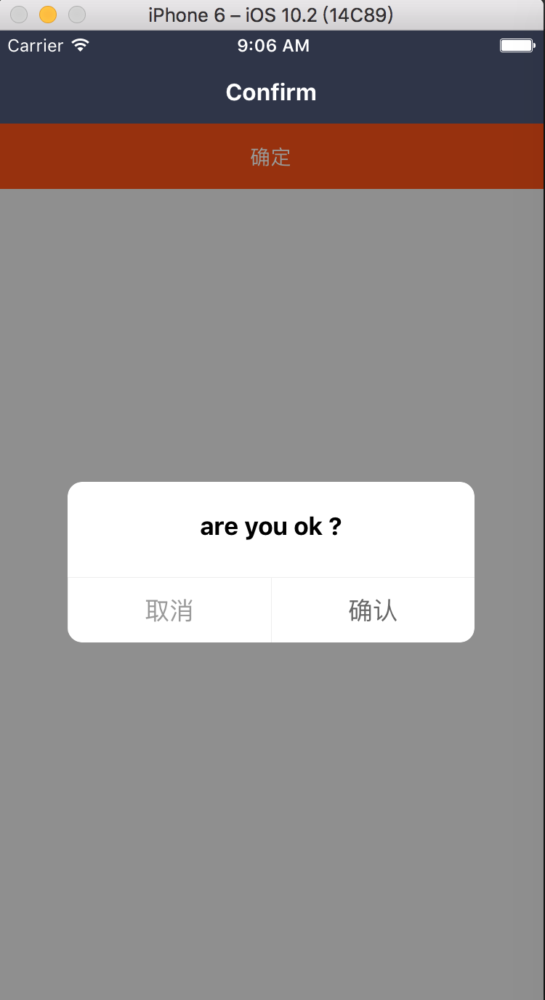

### Confirm: 确定弹出对话框

在 Dialog 组件进行了封装，同时也继承 Dialog 属性，支持左右两个按钮的形态

#### 使用方法

```js
 <Confirm
  title="are you ok ?"
  visible={this.state.visible}
/>
```

#### 具体效果



#### props

```js
Confirm.propTypes = {
  ...Dialog.propTypes,
  // 取消文本
  cancelTitle: PropTypes.string,
  // 取消文本样式
  cancelTitleStyle: Text.propTypes.style,
  // 取消点击回调
  onCancel: PropTypes.func,
  // 确认文本
  confirmText: PropTypes.string,
  // 确认文本样式
  confirmTextStyle: Text.propTypes.style,
  // 确认点击回调
  onConfirm: PropTypes.func,
};
```

#### 默认值

```js
Confirm.defaultProps = {
  ...Dialog.defaultProps,
  cancelTitle: '取消',
  cancelTitleStyle: null,
  onCancel: NOOP,
  confirmTitle: '确认',
  confirmTitleStyle: null,
  onConfirm: NOOP,
};
```
