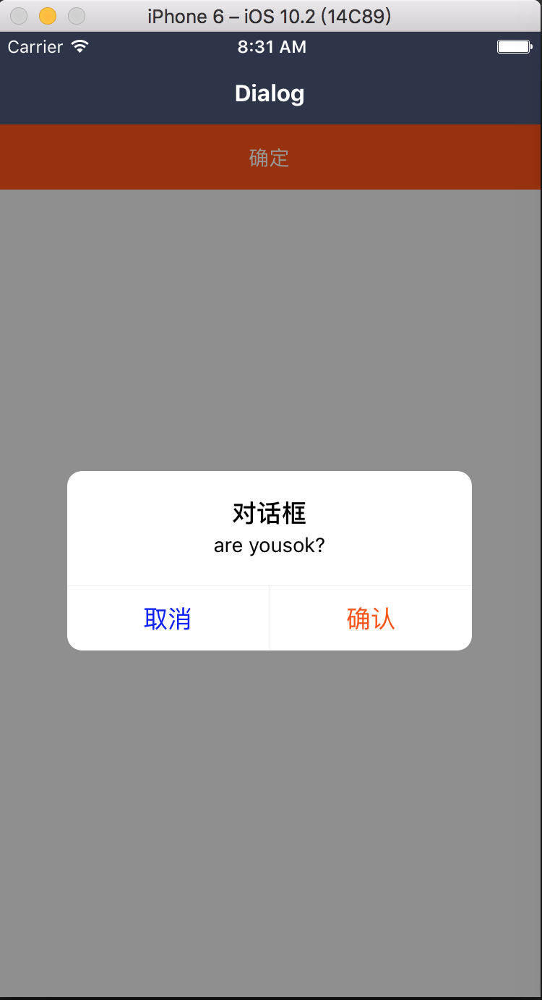

### Dialog: 对话框

依赖 Mask 遮罩层，支持 Alert 和 Confirm 两种形态。

#### 使用方法

```js
<Dialog
  btnOpts={[{
    key: 'cancel',
    title: '取消',
    style: styles.cancelStyle,
  },{
    key: 'confirm',
    title: '确认',
  }]}
  title="对话框"
  content="are you ok?"
  btnTextStyle={styles.btnStyle}
  visible={this.state.visible}
/>
```

#### 具体效果



#### props

```js
Dialog.propTypes = {
  // 控制开关
  visible: PropTypes.bool,
  // 遮罩层样式
  maskStyle: View.propTypes.style,
// 弹框样式
  style: View.propTypes.style,
  // 按钮样式
  btnStyle: View.propTypes.style,
  // 按钮文本样式
  btnTextStyle: Text.propTypes.style,
  // 按钮
  btnOpts: PropTypes.arrayOf(PropTypes.shape({
    // 唯一标识
    key: PropTypes.string,
    // 文本
    title: PropTypes.string,
    // 样式
    style: Text.propTypes.style,
    // 点击回调
    onPress: PropTypes.func,
  })),
  // 标题
  title: PropTypes.oneOfType([PropTypes.string, PropTypes.element]),
  // 标题容器样式, title 为字符串才有效
  titleWrapStyle: View.propTypes.style,
  // 标题文本样式 title 为字符串才有效
  titleStyle: Text.propTypes.style,
  // 内容
  content: PropTypes.oneOfType([PropTypes.string, PropTypes.element]),
  // 容器样式, 字符串才生效
  contentWarpStyle: Text.propTypes.style,
  // 文本样式, 字符串才生效
  contentStyle: Text.propTypes.style,
  // 按钮容器样式
  btnWrapStyle: View.propTypes.style,
};
```

#### 默认值

```js
Dialog.defaultProps = {
  visible: false,
  maskStyle: null,
  style: null,
  btnStyle: null,
  btnTextStyle: null,
  btnOpts: [],
  title: '',
  titleWrapStyle: null,
  titleStyle: null,
  content: '',
  contentWarpStyle: null,
  contentStyle: null,
  btnWrapStyle: null,
};
```
