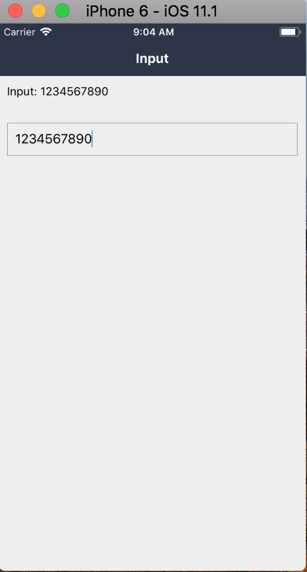

### Input: 输入框

基于 React Native 的 TextInput 封装而成，支持 TextInput 的 props 透传。

#### 使用方法

```js
<Input
  placeholder="placeholder"
  maxLength={11}
  editable={false}
  onChangeText={(val) => {
    this.setState({
      text: val,
    })
  }}
  ref={this.getInputRef}
/>
```

#### 具体效果



#### props

```js
Input.propTypes = {
  // 自定义样式
  style: View.propTypes.style,
  // 自定义输入框样式
  inputStyle: TextInput.propTypes.style,
  // 获取 TextInput 元素
  getInput: PropTypes.func,
  // 文本距离左边的间距
  paddingLeft: PropTypes.number,
  // placeholder color
  placeholderColor: PropTypes.string,
};
```

#### 默认值

```js
Input.defaultProps = {
  style: null,
  inputStyle: null,
  getInput: NOOP,
  paddingLeft: 10,
  placeholderColor: '#999',
};
```
