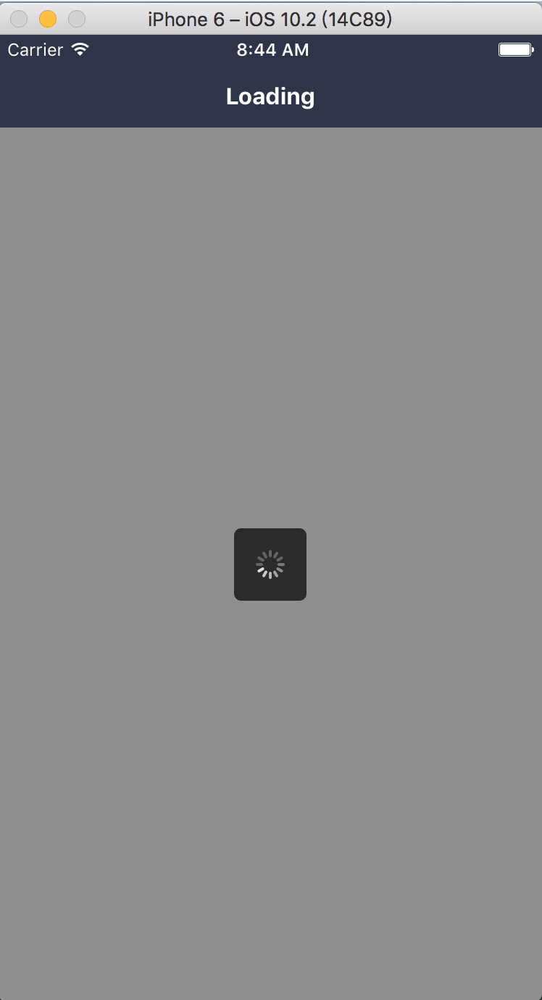

### Loading: 菊花

#### 使用方法

```js
<Loading visible={this.state.visible}>
  <View style={styles.view}>
    <Text />
  </View>
</Loading>
```
#### 效果

 

 #### 说明

 菊花是基于 ActivityIndicator 这个控件实现的，在 Android 和 IOS 上展示效果是不一样的。

#### props

```js
Loading.propTypes = {
  // 显示开关
  visible: PropTypes.bool.isRequired,
  // 遮罩层样式
  maskStyle: View.propTypes.style,
  // 菊花容器样式
  loadingStyle: View.propTypes.style,
  // 滚轮的前景颜色（默认为灰色)
  color: ActivityIndicator.propTypes.color,
  // 指示器的大小[small、large]. small 的高度为 20, large 为 36
  size: ActivityIndicator.propTypes.size,
};
```

#### 默认值

```js
Loading.defaultProps = {
  visible: false,
  maskStyle: null,
  loadingStyle: null,
  color: '#fff',
  size: 'small',
};

```
