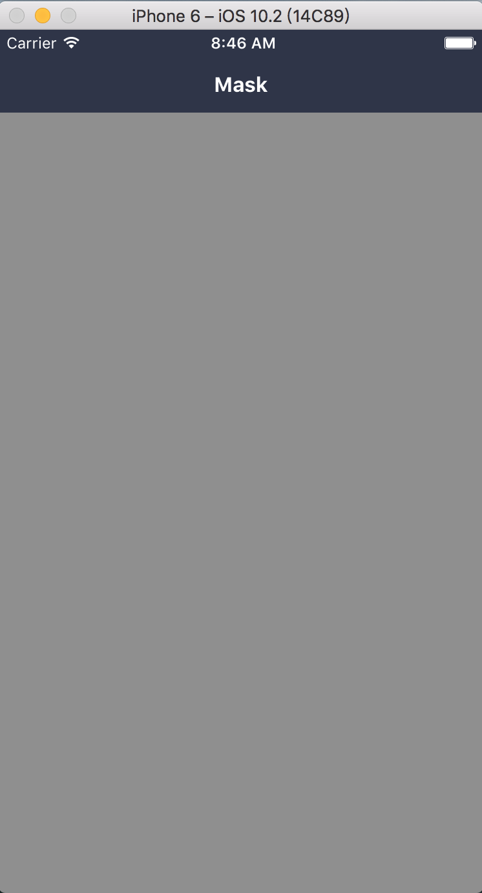

### Mask: 遮罩层

#### 使用方法

```js
<View style={styles.container}>
  <Mask visible={this.state.visible}  pointerEvents="none">
    <View style={styles.view}>
      <Btn />
    </View>
  </Mask>
</View>
```
#### 效果

 

#### props

```js
// 自定义样式
  style: View.propTypes.style,
  // 显示开关
  visible: PropTypes.bool.isRequired,
  // 点击回调
  onPress: PropTypes.func,
  /**
   * 控制 Mask 是否可以作为触控事件的目标
   * none 发生在本组件与本组件的子组件上的触摸事件都会交给本组件的父组件处理
   * box-none 发生在本组件显示范围内, 但不是子组件显示范围内的事件交给本组件, 在子组件显示范围内交给子组件处理
   * box-only 发生在本组件显示范围内的触摸事件将全部由本组件处理, 即使触摸事件发生在本组件的子组件显示范围内
   * auto 视组件的不同而不同, 并不是所有的子组件都支持box-none和box-only两个值
   */
  pointerEvents: View.propTypes.pointerEvents,
  // 动画时长
  duration: PropTypes.number,
  // 子元素
  children: PropTypes.oneOfType([PropTypes.element, PropTypes.array]),
```

#### 默认值

```js
Mask.defaultProps = {
  style: null,
  visible: false,
  onPress: NOOP,
  pointerEvents: 'none',
  duration: 200,
  children: null,
};
```
