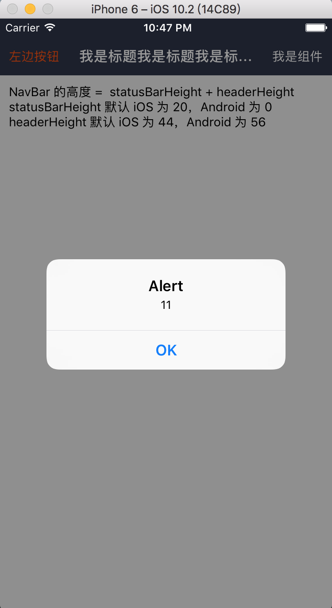

### NavBar: 标题

#### 使用方法

```js
<NavBar
  title="我是标题我是标题我是标题我是标题"
  titleStyle={{width: 200}}
  leftBtn="左边按钮"
  leftBtnStyle={{color: '#FF5200'}}
  rightBtn={(
    <View>
      <Text style={{color: '#FFF'}}>我是组件</Text>
    </View>
  )}
  handelLeftBtn={() => {alert(11)}}
  disableRightBtn
/>
```
#### 点击左边按钮的效果

 

#### propTypes

```js
NavBar.propTypes = {
  // 自定义样式
  style: View.propTypes.style,
  // 标题: 可以是文本，也可以是组件
  title: PropTypes.oneOfType([PropTypes.string, PropTypes.element]),
  // 标题样式: 当标题是文本时才生效
  titleStyle: Text.propTypes.style,
  // 左侧按钮: 可以是文本，也可以是组件
  leftBtn: PropTypes.oneOfType([PropTypes.string, PropTypes.element]),
  // 左侧按钮样式: 当 leftBtn 为文本时才生效
  leftBtnStyle: Text.propTypes.style,
  // 右侧按钮: 可以是文本，也可以是组件
  rightBtn: PropTypes.oneOfType([PropTypes.string, PropTypes.element]),
  // 右侧按钮样式: 当 leftBtn 为文本时才生效
  rightBtnStyle: Text.propTypes.style,
  // statusBar 高度
  statusBarHeight: PropTypes.number,
  // header 高度
  headerHeight: PropTypes.number,
  // 标题容器的样式
  titleWrapStyle: View.propTypes.style,
  // 左侧按钮点击事件
  handelLeftBtn: PropTypes.func,
  // 是否禁用左侧按钮
  disableLeftBtn: PropTypes.bool,
  // 左侧按钮容器的样式
  leftBtnWrapStyle: View.propTypes.style,
  // 左侧按钮点击事件
  handelRightBtn: PropTypes.func,
  // 是否禁用左侧按钮
  disableRightBtn: PropTypes.bool,
  // 左侧按钮容器的样式
  rightBtnWrapStyle: View.propTypes.style,
  // 按钮点击透明度变化
  activeOpacity: PropTypes.number,
};
```

#### 默认值

```js
NavBar.defaultProps = {
  style: null,
  title: '',
  titleStyle: null,
  leftBtn: '',
  leftBtnStyle: null,
  rightBtn: '',
  rightBtnStyle: null,
  statusBarHeight: STATUS_BAR_HEIGHT,
  headerHeight: HEADER_HEIGHT,
  titleWrapStyle: null,
  handelLeftBtn: NOOP,
  disableLeftBtn: false,
  leftBtnWrapStyle: null,
  handelRightBtn: NOOP,
  disableRightBtn: false,
  rightBtnWrapStyle: null,
  activeOpacity: 0.8,
};
```
