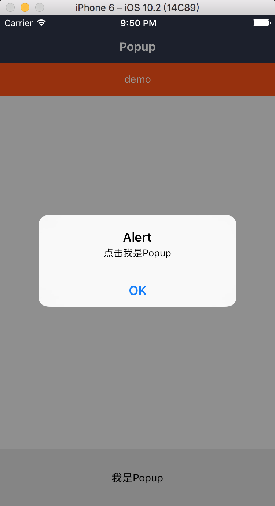

###  Popover 底部弹层

依赖 Mask 组件

#### 使用方法

```js
<View style={styles.container}>
  <Popover visible={this.state.visible}>
    <View style={styles.view}>
      <Btn />
    </View>
  </Popover>
</View>
```
#### 效果



#### props

```js
Popover.propTypes = {
  // 控制开发
  visible: PropTypes.bool.isRequired,
  // 遮罩层的样式
  maskStyle:  View.propTypes.style,
  // 点击遮罩层事件
  onPress: PropTypes.func,
  // 自定义样式
  style: View.propTypes.style,
  // 子元素
  children: PropTypes.oneOfType([PropTypes.element, PropTypes.array]),
  // 动画时长
  duration: PropTypes.number,
  // 打开回调
  onOpen: PropTypes.func,
  // 关闭回调
  onClose: PropTypes.func,
  // 事件默认透传
  pointerEvents: View.propTypes.pointerEvents,
};
```

#### 默认值

```js
Popover.defaultProps = {
  visible: false,
  maskStyle: null,
  onPress: NOOP,
  style: null,
  children: null,
  duration: 200,
  onOpen: NOOP,
  onClose: NOOP,
  pointerEvents: 'auto',
};
```
