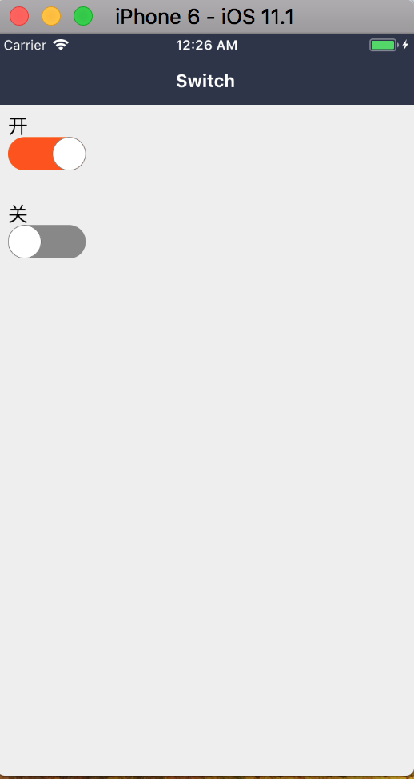

### Switch 开关

#### 使用方法

```js
<Switch
  value={this.state.visible}
  onChange={this.onChange}
/>
```
#### demo



#### props

```js
Switch.propTypes = {
  // change callback
  onChange: PropTypes.func,
  // 开关的状态
  value: PropTypes.bool,
  // 是否禁用
  disabled: PropTypes.bool,
  // 打开的背景色
  backgroundActive: PropTypes.string,
  // 关闭的背景色
  backgroundInactive: PropTypes.string,
  // 打开的边框颜色
  activeCircleColor: PropTypes.string,
  // 关闭的边框颜色
  deActiveCircleColor: PropTypes.string,
  // 动画时长
  duration: PropTypes.number,
  // 宽度
  switchWidth: PropTypes.number,
  // 高度
  switchHeight: PropTypes.number,
};
```

#### 默认值

```js
Switch.defaultProps = {
  onChange: () => null,
  value: false,
  disabled: false,
  backgroundActive: '#FF5200',
  backgroundInactive: '#888',
  activeCircleColor: '#FFF',
  deActiveCircleColor: '#FFF',
  duration: 200,
  switchWidth: 70,
  switchHeight: 30,
};
```
