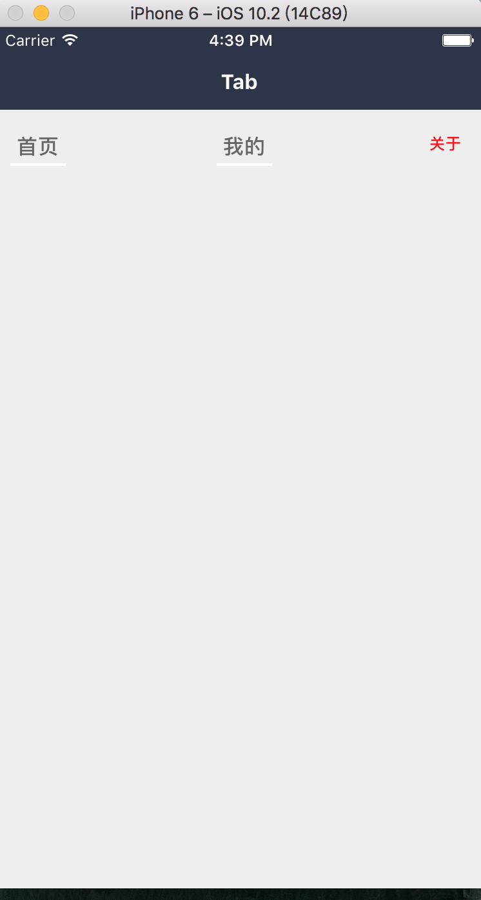

### Tab

#### 使用方法

```js
this.tabOpts = [{
  key: 'home',
  title: '首页',
  onPress: () => {},
  active: false,
}, {
  key: 'mine',
  title: '我的',
  onPress: () => {},
  active: false,
}, {
  key: 'about',
  title: '关于',
  onPress: () => {},
  active: true,
  itemStyle: {
    titleStyle: styles.titleStyle,
    activeTitleStyle: styles.activeTitleStyle,
  }
}]

<Tab
  tabOpts={this.tabOpts}
  tabItemstyle={{
    paddingTop: 20,
  }}
  borderStyle={{borderBottomColor: '#fff'}}
  activeBorderStyle={{
    borderBottomColor: '#EEE'
  }}
  titleStyle={{
    fontSize: 16,
  }}
  activeTitleStyle={{color: 'blue'}}
/>
```
#### 点击左边按钮的效果

 

#### props

```js
Tab.propTypes = {
  // 自定义容器样式
  style: View.propTypes.style,
  // tab 数据配置
  tabOpts: PropTypes.array.isRequired,
  // 自定义 tabItem 容器样式
  tabItemstyle: View.propTypes.style,
  // 默认底部 border 的样式
  borderStyle: View.propTypes.style,
  // 选中 tab 底部 border 的样式
  activeBorderStyle: View.propTypes.style,
  // title 的样式 当 title 为字符串才生效
  titleStyle: Text.propTypes.style,
  // 选中的 title 样式
  activeTitleStyle: Text.propTypes.style,
};
```

#### 默认值

```js
Tab.defaultProps = {
  style: null,
  tabOpts:[{
    key: '',
    // 标题
    title: '',
    // onPress 事件
    onPress: '',
    active: false,
    itemStyle: {
      // 自定义的样式
      borderStyle: null,
      activeBorderStyle: null,
      titleStyle: null,
      activeTitleStyle: null,
    },
  }],
  // 通用的样式设置
  tabItemstyle: null,
  borderStyle: null,
  activeBorderStyle: null,
  titleStyle: null,
  activeTitleStyle: null,
};
```
