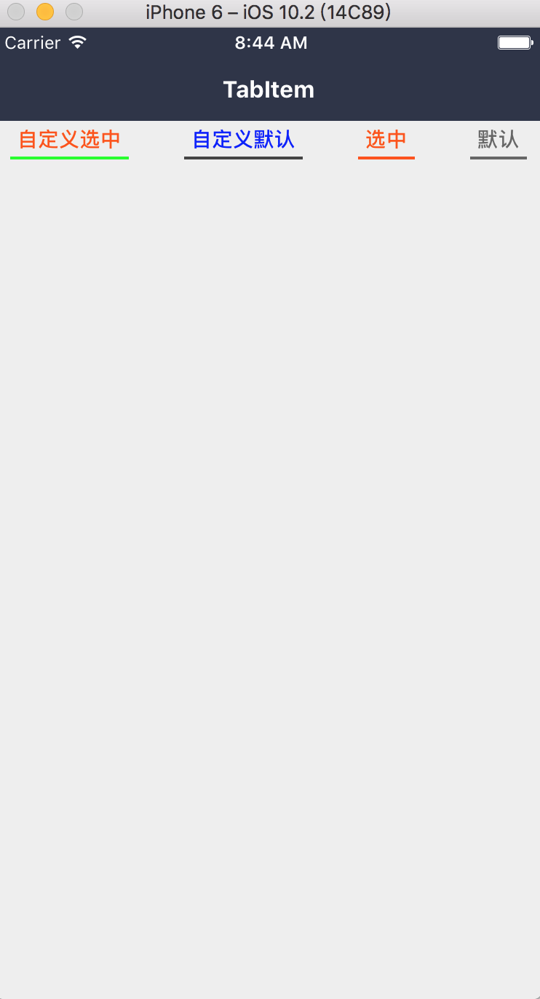

### TabItem

#### 使用方法

```js
 <View style={styles.tab}>
  <TabItem title="自定义选中"
    active
    activeBorderStyle={{
      borderBottomColor: '#00FF00'
    }}
  />
  <TabItem title="自定义默认"
    borderStyle={{
      borderBottomColor: '#444'
    }}
    titleStyle={{
      color: 'blue',
    }}
    onPress={() => {alert(1)}}/>
  <TabItem title="选中" active />
  <TabItem title="默认" />
</View>
```
#### 点击左边按钮的效果

 

#### props

```js
TabItem.propTypes = {
  // 自定义容器样式
  style: View.propTypes.style,
  // title
  title: PropTypes.oneOfType([PropTypes.string, PropTypes.element]),
  // 默认底部 border 的样式
  borderStyle: View.propTypes.style,
  // 选中 tab 底部 border 的样式
  activeBorderStyle: View.propTypes.style,
  // title 的样式 当 title 为字符串才生效
  titleStyle: Text.propTypes.style,
  // 选中的 title 样式
  activeTitleStyle: Text.propTypes.style,
  // 选中的状态
  active: PropTypes.bool,
  // onPress
  onPress: PropTypes.func,
};
```

#### 默认值

```js
TabItem.defaultProps = {
  style: null,
  title: '',
  borderStyle: null,
  activeBorderStyle: null,
  titleStyle: null,
  activeTitleStyle: null,
  active: false,
  onPress: NOOP,
};
```
