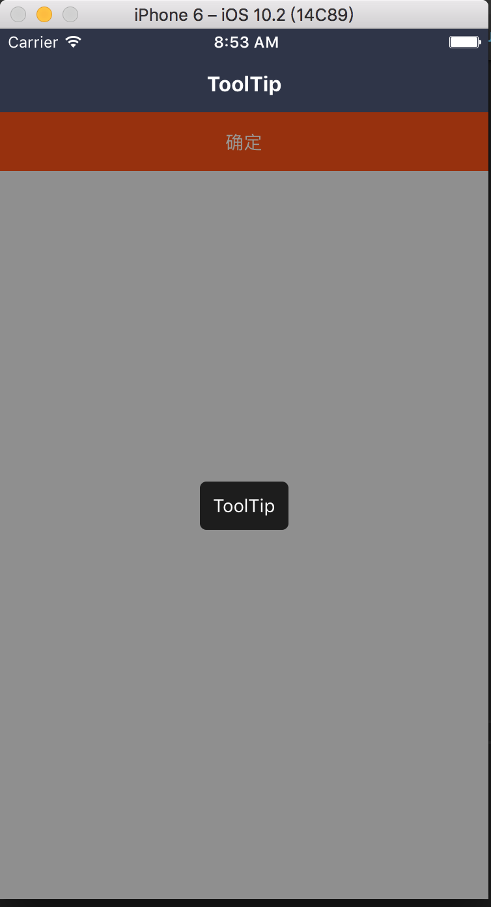

### ToolTip: 提示框组件

依赖 Mask 组件

#### 使用方法

```js
<View style={styles.container}>
  <ToolTip visible={this.state.visible} text="warning" />
</View>
```
#### 效果



#### props

```js
ToolTip.propTypes = {
  // 控制开关
  visible: PropTypes.bool.isRequired,
  // 遮罩层样式
  maskStyle: View.propTypes.style,
  // 控制 Mask 是否可以作为触控事件的目标
  pointerEvents: Mask.propTypes.pointerEvents,
  // 文本容器样式
  textWrapperStyle: View.propTypes.style,
  // 文本样式
  textStyle: Text.propTypes.style,
  // 文本
  text: PropTypes.string.isRequired,
};
```

#### 默认值

```js
ToolTip.defaultProps = {
  visible: false,
  maskStyle: null,
  pointerEvents: 'auto',
  textWrapperStyle: null,
  textStyle: null,
  text: '',
};
```
